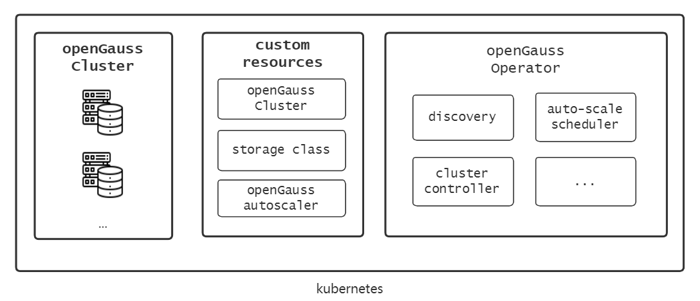

# openGauss-controller

The openGauss-controller uses the [client-go](https://github.com/kubernetes/client-go) library to develop a custom controller monitoring, scheduling and updating openGauss cluster in kubernetes.

## Build & Run

```
# Fetch the project
git clone https://github.com/waterme7on/openGauss-controller.git
cd openGauss-controller

# Build
go build -o controller .
# kubeconfig won't be needed if run in-cluster
./controller -kubeconfig=$HOME/.kube/config

# create openGauss CustomResourceDefination
kubectl create -f manifests/crd.yaml
# create a openGauss object
kubectl create -f example/opengauss.yaml
# check all the components of opengauss defined by example
kubect get all | grep opengauss
```


## Structure



<br>

## Develop

### Use code-generator to update apis

Use [code-generator](https://github.com/kubernetes/code-generator) to update code if you want to modify openGauss apis.

You may need to manually install [code-generator](https://github.com/kubernetes/code-generator) or use command `go mod vendor` to create and populate `vendor` diretory to get the source file.

Build command:

```
# get the code-generator
go mod vendor
# or use command "go get k8s.io/code-generator"

# update apis
bash hack/update-codegen.sh
# then build and run
```

### [client-go under the hood](https://github.com/kubernetes/sample-controller/blob/master/docs/controller-client-go.md)

how the various components in the [client-go](https://github.com/kubernetes/client-go) library work and their interaction points with the custom controller code


