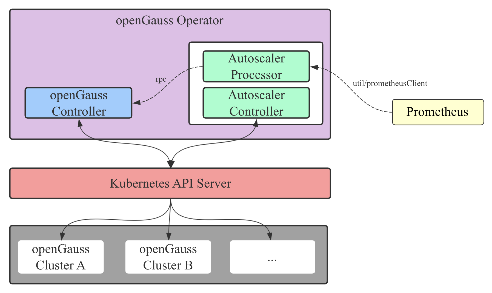

# openGauss-operator

The openGauss-operator uses the [client-go](https://github.com/kubernetes/client-go) library to develop a custom controller monitoring, scheduling and updating openGauss cluster in kubernetes.

### Table of Content

- [Build & Run](#Build-&-Run)
- [Structure](#Structure)
- [Develop](#Develop)


## 1. Build & Run
### Deploy Prometheus Monitoring

Use prometheus to monitor the pod and node status.

Follow [kube-prometheus quick start](https://github.com/prometheus-operator/kube-prometheus#quickstart) to install prometheus stack.

### Generate code
Before generating code, make sure your project is in a directory with path `xxx/github.com/waterme7on/`.

Fetch code-generator repo and execute script.

```sh
go mod vendor
./hack/update-codegen.sh
```

### Deploy OpenGauss controller

Fetch the project
```sh
git clone https://github.com/waterme7on/openGauss-operator.git
cd openGauss-operator
```

Build and Run in Process
```sh
go build -o controller .
# kubeconfig won't be needed if run in-cluster
./controller -kubeconfig=$HOME/.kube/config
```

Or Run in Deploymente
```sh
kubectl apply -f manifests manifests/serviceaccount.yaml 
kubectl apply -f manifests/deploy.yaml
```


Create Crd and example OpenGauss cluster

```sh
# create openGauss CustomResourceDefination
kubectl create -f manifests/crd.yaml
# create a openGauss object
kubectl create -f example/opengauss.yaml
```

Check status

```sh
# check all the components of opengauss defined by example
kubectl get all | grep opengauss
```

Add new master

```sh
# connect to mycat with mysql client, default user "mycat" and password "123456"
# create table using mysql client

# example in example/opengauss.yaml and example/opengauss-new-master.yaml
```

## 2. Structure

data flow and logic graph



<br>

components


<br>

## 3. Develop

### Contributions

1. modify
2. git checkout -b xxx
3. git push origin xxx:feat_xxx
4. pull request

### Use code-generator to update apis

Use [code-generator](https://github.com/kubernetes/code-generator) to update code if you want to modify openGauss apis.

You may need to manually install [code-generator](https://github.com/kubernetes/code-generator) or use command `go mod vendor` to create and populate `vendor` diretory to get the source file.

Build command:

```sh
# get the code-generator
go mod vendor
# or use command "go get k8s.io/code-generator"

# update apis
bash hack/update-codegen.sh
# then build and run
```

### [client-go under the hood](https://github.com/kubernetes/sample-controller/blob/master/docs/controller-client-go.md)

how the various components in the [client-go](https://github.com/kubernetes/client-go) library work and their interaction points with the custom controller code


### grpc code generate

For protoc installation and instructions, see [grpc in go](https://grpc.io/docs/languages/go/)

```sh
cd rpc
protoc --go_out=. --go_opt=paths=source_relative     --go-grpc_out=. --go-grpc_opt=paths=source_relative    protobuf/clients.proto
```
